# Create JAR with Scala & Execute on Azure Databricks

> <i>by Alberto Cesar <gato.playero@proton.me></i>

<hr>

## Table of Contents
1. **[Configure Databricks Cluster](#ConfigureDatabricksCluster)**
2. **[Install JDK](#Install-JDK)**
3. **[Install Conda](#Install-Conda)**
4. **[Uninstall Anaconda](#Uninstall-Anaconda)**
5. **[Install WinUtils](#Install-WinUtils)**
6. **[Create Virtual Environment on Conda](#Create-Virtual-Environment-on-Conda)**
7. **[Update pip](#Update-pip)**
8. **[Install Databricks-Connect](#Install-Databricks-Connect)**
9. **[Configurations on Databricks Cluster](#Configurations-on-Databricks-Cluster)**
10. **[Install databricks-cli](#Install-databricks-cli)**
11. **[Configure databricks-connect](#Configure-databricks-connect)**
12. **[Test databricks-connect](#Test-databricks-connect)**

<hr>

## <font style="Color:blue;">Configure&nbsp;Databricks&#160;Cluster</font>

I’ll go directly to the development without entering into the Databricks setup and configuration on Azure, you could find more information on:

- https://docs.microsoft.com/en-us/azure/storage/blobs/data-lake-storage-use-databricks-spark
- https://docs.microsoft.com/en-us/azure/storage/blobs/data-lake-storage-quickstart-create-databricks-account
- https://docs.microsoft.com/en-us/azure/databricks/getting-started/try-databricks
- https://docs.microsoft.com/en-us/azure/azure-databricks/

## <font style="Color:blue;">Install JDK</font>

Download JDK from [https://www.oracle.com/java/technologies/javase-jdk8-downloads.html](https://www.oracle.com/java/technologies/javase-jdk8-downloads.html), is required to work on JDK Version 8

<!-- 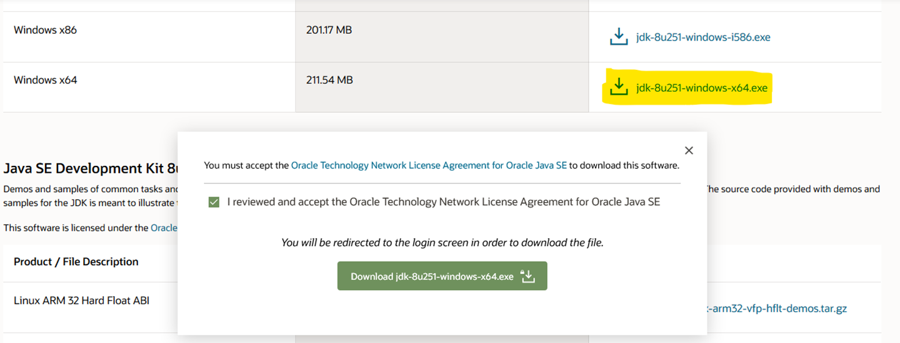 -->


Install JAVA on [```C:\JAVA\```] folder:

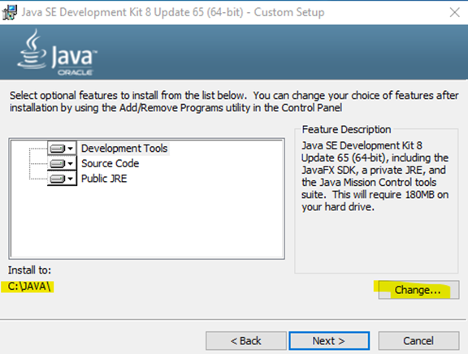

You should install JRE on a separated folder:

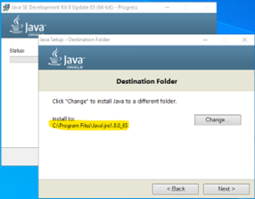

You should be able to review if installed correctly through command prompt using “```java -version```”:

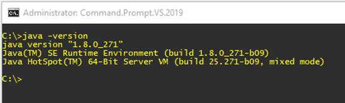

Once installed, you should configure the global “```JAVA_HOME```” environment variable, you could do it on PowerShell (*as administrator*):


```powershell applyLineNumbers
[Environment]::SetEnvironmentVariable("JAVA_HOME", "C:\JAVA", "Machine")
```

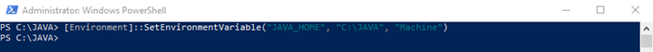

Once added, you could add path environment (```%JAVA_HOME%\bin```):

| 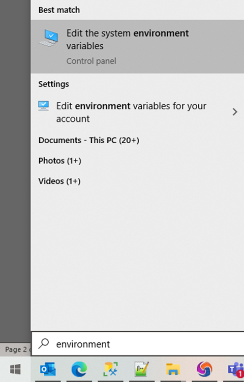 |  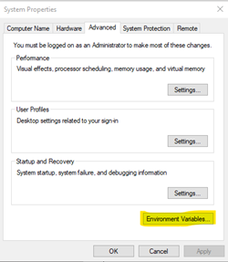  |
|	-----	|	-----	|
|	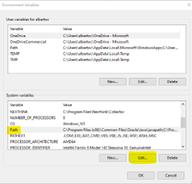	|	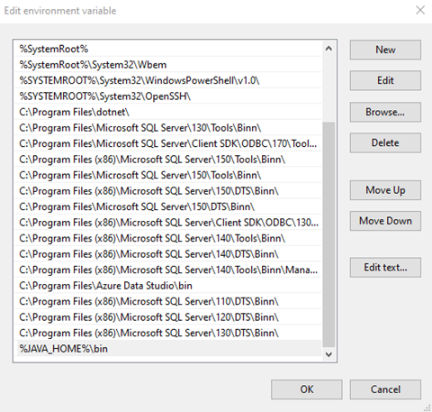	|


Don’t forget disable the automatic updates:

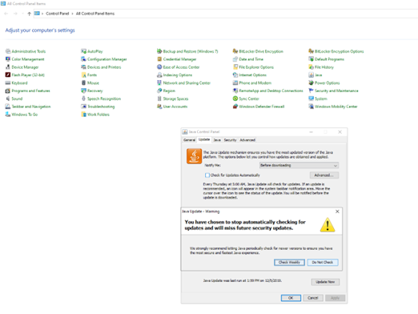

## <font style="Color:blue;">Install Conda</font>

You could install anaconda distribution from [https://repo.anaconda.com/archive/Anaconda3-2022.10-Windows-x86_64.exe](https://repo.anaconda.com/archive/Anaconda3-2022.10-Windows-x86_64.exe):

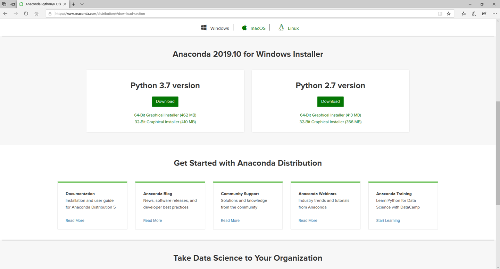

Install on [```C:\Anaconda3\```] folder:

| 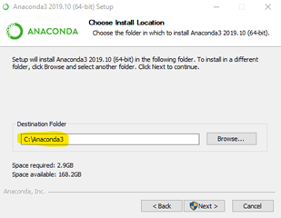 |  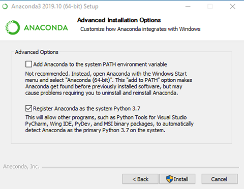  |
|	-----	|	-----	|

## <font style="Color:blue;">Uninstall Anaconda</font>

To uninstall Anaconda, you can do a simple remove of the program. This will leave a few files behind, which for most users is just fine. See [**Option A**](#-option-a---use-simple-remove-to-uninstall-anaconda).

### • **Option A** - Use simple remove to uninstall Anaconda:

* Windows–In the Control Panel, choose Add or Remove Programs or Uninstall a program, and then select Python 3.*n* (*Anaconda*) or your version of Python.

* Use Uninstall-Anaconda.exe in [```C:\Users\username\Anaconda3```]

* [... also solutions for Mac and Linux are provided here: [https://docs.anaconda.com/anaconda/install/uninstall/](https://docs.anaconda.com/anaconda/install/uninstall/) ]

### • **Option B** - Full uninstall using ```Anaconda-Clean``` and simple remove. **NOTE:** Anaconda-Clean must be run before simple remove.

* Install the Anaconda-Clean package from Anaconda Prompt (*Terminal on Linux or macOS*):

* ```conda install anaconda-clean```

* In the same window, run one of these commands:

	* Remove all Anaconda-related files and directories with a confirmation prompt before deleting each one:

	* ```anaconda-clean``` 

	* Or, remove all Anaconda-related files and directories without being prompted to delete each one:

	* ```anaconda-clean –yes```

* *Anaconda-Clean* creates a backup of all files and directories that might be removed in a folder named ```.anaconda_backup``` in your home directory. Also note that *Anaconda-Clean* leaves your data files in the *AnacondaProjects* directory untouched.

* After using *Anaconda-Clean*, follow the instructions above in [**Option A**](#-option-a---use-simple-remove-to-uninstall-anaconda) to uninstall Anaconda.

## <font style="Color:blue;">Install WinUtils</font>

You could install [WinUtils](https://github.com/steveloughran/winutils) using next PowerShell script (*as administrator*):

```powershell
cd \;
mkdir “hadoop”;
New-Item -Path "C:\hadoop\bin" -ItemType Directory -Force;
Invoke-WebRequest -Uri https://github.com/steveloughran/winutils/blob/master/hadoop-3.0.0/bin/winutils.exe -OutFile "C:\hadoop\bin\winutils.exe";
[Environment]::SetEnvironmentVariable("HADOOP_HOME", "C:\hadoop", "Machine");
```

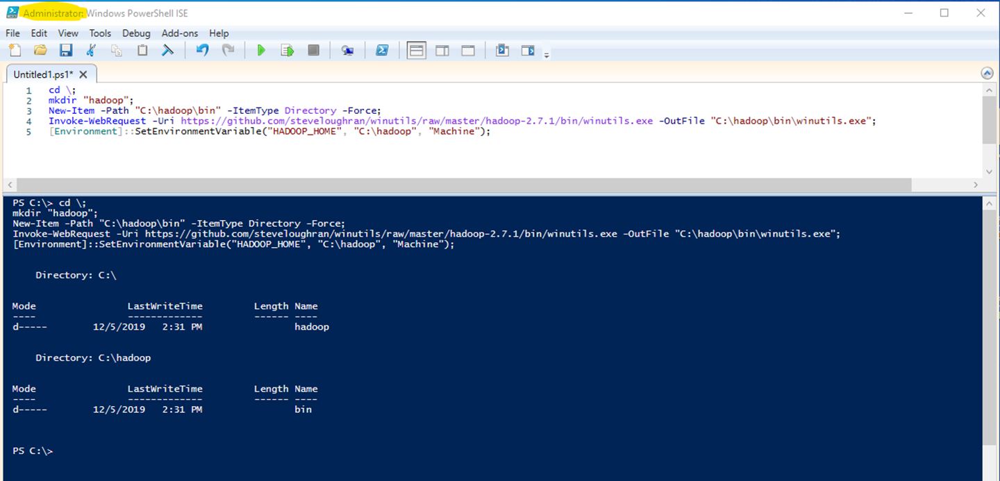

## <font style="Color:blue;">Create Virtual Environment on Conda</font>

I recommend you create a separated Virtual Environment on conda to setup your installations and configurations, you could find additional information on:

[https://docs.conda.io/projects/conda/en/latest/user-guide/concepts/environments.html](https://docs.conda.io/projects/conda/en/latest/user-guide/concepts/environments.html)

[https://docs.conda.io/projects/conda/en/latest/user-guide/tasks/manage-environments.html](https://docs.conda.io/projects/conda/en/latest/user-guide/tasks/manage-environments.html)


On this example, we’ll use one called “*```GatoPlayero```*”, but you can change it using whatever you want, obviously with names without blank spaces. On Anaconda PowerShell Prompt run [```conda create --name GatoPlayero python=3.9.12```]:

|	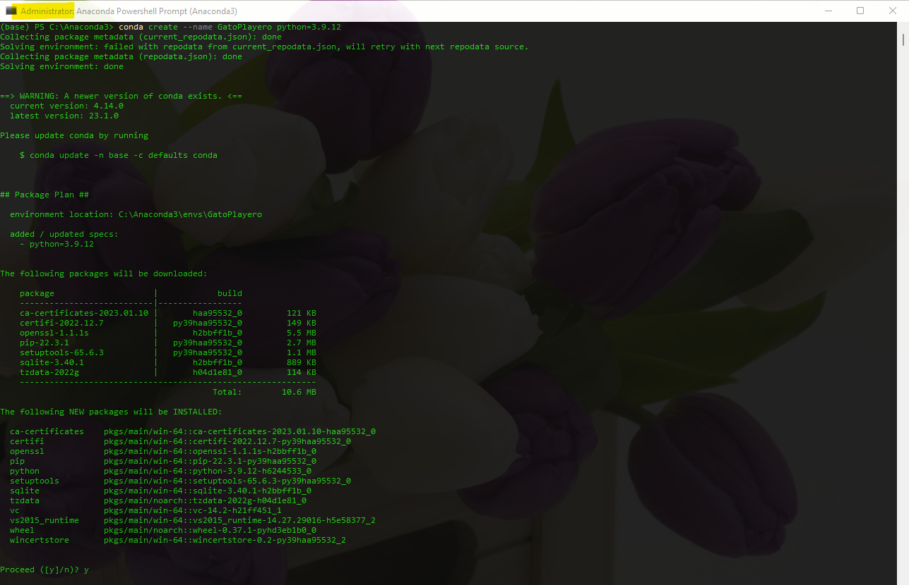	|
|	-----	|
|	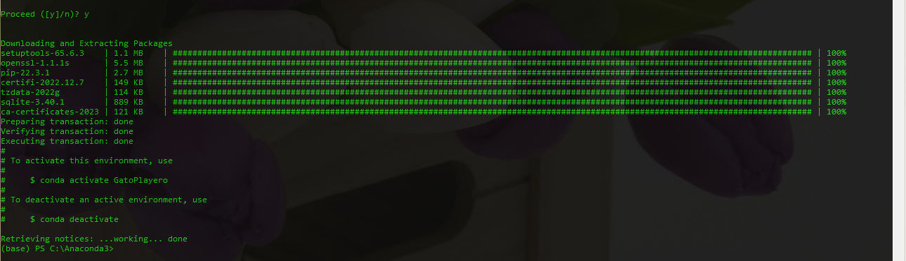	|

To check Python Version use “```python --version```” on conda.

On Databricks ***Runtime 6+ Python*** you should use [```conda create --name GatoPlayero python=3.9.12```]

You could do more with the Virtual Environments:

|	Action	|	Command	|
|	-----	|	-----	|
|	•	List:	|	```conda info --envs```	|
|	•	Remove:	|	```conda env remove --name GatoPlayero```	|
|	•	Activate:	|	```conda activate GatoPlayero```	|
|	•	Deactivate:	|	```conda deactivate```	|

## <font style="Color:blue;">Update pip</font>

Activate Virtual Environment using [```conda activate GatoPlayero```], once you’re on your virtual environment you could run [```pip uninstall pyspark```], then run [```python -m pip install --upgrade pip```] to update pip:

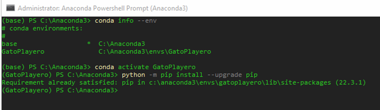

## <font style="Color:blue;">Install Databricks-Connect</font>

Run [```pip install -U databricks-connect```] or if you’re using ***Python3*** use [```pip3 install -U databricks-connect==10.4.*```] to install on conda virtual environment the same version used on your cluster, consider that you should review the runtime on your cluster:


You should configure remote port on cluster advanced configurations, add next lines (*you could change default port 15001*) on spark config for the remote cluster:

```
spark.databricks.service.port 15001
spark.databricks.service.server.enabled true
spark.databricks.delta.preview.enabled true
```

You could always uninstall any version installed through [```pip list```], you could list the libraries installed and uninstall them indicating a specific version:

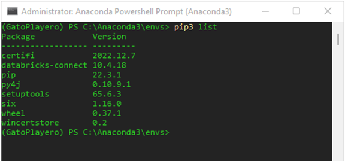


You could find additional information (including troubleshooting) on: 

- https://docs.microsoft.com/en-us/azure/databricks/dev-tools/databricks-connect
- https://docs.databricks.com/dev-tools/databricks-connect.html
- https://pypi.org/project/databricks-connect/

## <font style="Color:blue;">Configurations on Databricks Cluster</font>

You should create a Token on Azure Databricks cluster before configure it locally [*https://docs.microsoft.com/en-us/azure/databricks/dev-tools/api/latest/authentication*]:

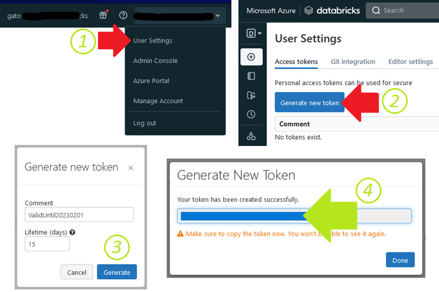

With the URL of the cluster, you should be able to extract all required information for local configuration:

|	URL	|	[<font style="font-family:courier, courier new, serif;font-size:16px;Color:OrangeRed;">https://westus.azuredatabricks.net/</font><font style="font-family:courier, courier new, serif;font-size:16px;Color:DimGray;">?o=</font><font style="font-family:courier, courier new, serif;font-size:16px;Color:Blue;">7692xxxxxxxx</font><font style="font-family:courier, courier new, serif;font-size:16px;Color:DimGray;">#/setting/clusters/</font><font style="font-family:courier, courier new, serif;font-size:16px;Color:Green;">xxxx-xxxxxx-chxxxxx</font><font style="font-family:courier, courier new, serif;font-size:16px;Color:DimGray;">/configuration</font>](#) |
|	:-----	|	:-----	|
|	Organization ID	|	**<font style="font-family:courier, courier new, serif;font-size:16px;Color:Blue;">7692xxxxxxxx</font>**	|
|	Port	|	15001	|
|	Host URL	|	[**<font style="font-family:courier, courier new, serif;font-size:16px;Color:OrangeRed;">https://westus.azuredatabricks.net/</font>**](#)	|
|	Cluster ID	|	**<font style="font-family:courier, courier new, serif;font-size:16px;Color:Green;">xxxx-xxxxxx-chxxxxx</font>**

## <font style="Color:blue;">Install databricks-cli</font>

Run [```pip install databricks-cli```] or if using ***Python3***, run [```pip3 install databricks-cli```] on conda environment (*disable firewall if required*):

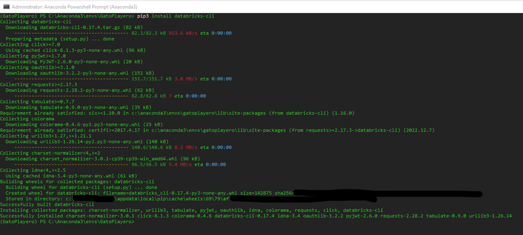


## <font style="Color:blue;">Configure databricks-connect</font>

Run [```databricks-connect configure```] on conda environment, enter all previous configurations as requested:

|	[```databricks-connect configure```]	|	Disable firewall if required:	|
|	-----	|	-----	|
| 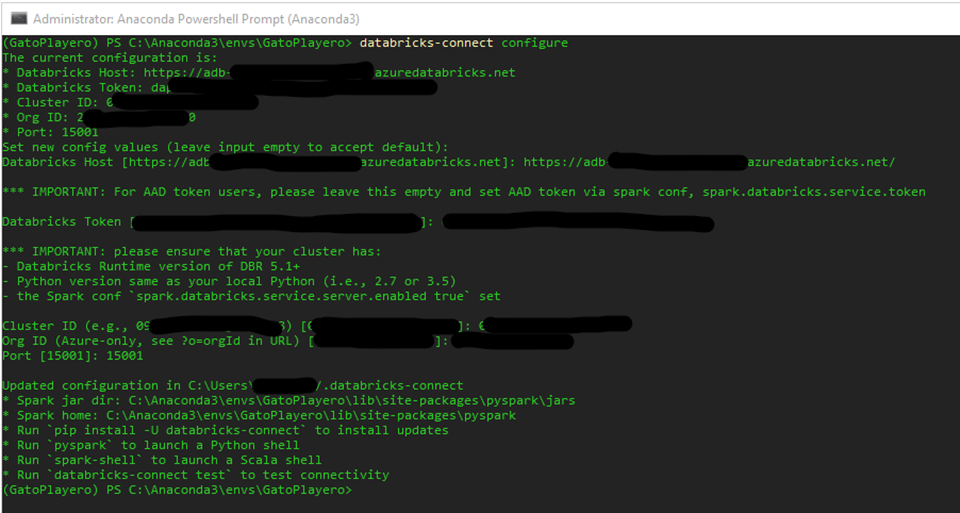 |  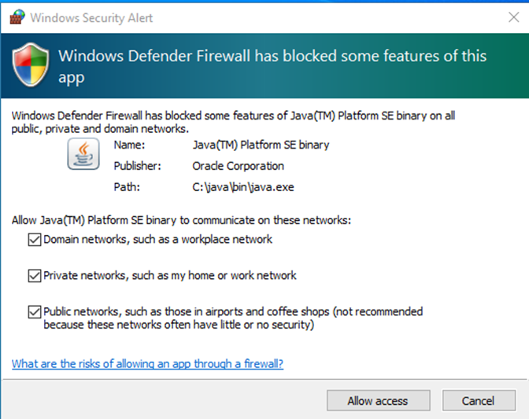  |

Output:

```
Updated configuration in C:\Users\albertoc/.databricks-connect
* Spark jar dir: C:\Anaconda3\envs\GatoPlayero\lib\site-packages\pyspark\jars
* Spark home: C:\Anaconda3\envs\GatoPlayero\lib\site-packages\pyspark
* Run `pip install -U databricks-connect` to install updates
* Run `pyspark` to launch a Python shell
* Run `spark-shell` to launch a Scala shell
* Run `databricks-connect test` to test connectivity
```

 **<font style="Color:red;">IMPORTANT NOTE:</font>**&nbsp;You could review or renew the configurations anytime running again [```databricks-connect configure```] on conda environment as required.

Run [```databricks configure --token```] to configure token and run [```databricks --version```] to review installed version:

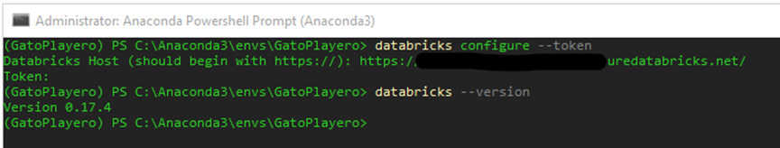

 **<font style="Color:red;">IMPORTANT NOTE:</font>**&nbsp;You could review or renew the token configurations anytime running again [```databricks configure --token```] on conda environment as required.

Check the ```.databrickscfg``` file on [```C:\Users\<currentUser>\.databrickscfg```] contains a corresponding profile entry:

```html
[<profile-name>]
host = <workspace-URL>
token = <token>
```

```
[DEFAULT]
host = https://xxxxxxxxxxxxxxxxxxx.azuredatabricks.net
token = xxxxxxxxxxxxxxxxxxxxxxxxxxxxxxxxx-2
jobs-api-version = 2.0
```

Check the ```.databricks-connect``` file on [```C:\Users\<currentUser>\.databricks-connect```] contains a corresponding profile entry:

```json
{
	"host": "https:// xxxxxxxxxxxxxxxxxxx.azuredatabricks.net",
	"token": "d xxxxxxxxxxxxxxxxxxxxxxxxxxxxxxxxx-2",
	"cluster_id": "xxxx-xxxxxx-xxxxxxx",
	"org_id": "xxxxxxxxxxxx",
	"port": "15001"
}
```

Additional information [https://docs.microsoft.com/en-us/azure/databricks/dev-tools/databricks-cli]


## <font style="Color:blue;">Test databricks-connect</font>

Now you&#x2019;re ready to connect to your cluster, if the cluster is turned off for inactivity, the connection will start it automatically, run [```databricks-connect test```] on conda environment:

