# Create JAR with Scala & Execute on Azure Databricks

> <i>by Alberto Cesar <gato.playero@proton.me></i>

<hr>

## Table of Contents
1. **[Configure Databricks Cluster](#ConfigureDatabricksCluster)**
2. **[Install JDK](#Install-JDK)**
3. **[Install Conda](#Install-Conda)**
4. **[Uninstall Anaconda](#Uninstall-Anaconda)**
5. **[Install WinUtils](#Install-WinUtils)**
6. **[Create Virtual Environment on Conda](#Create-Virtual-Environment-on-Conda)**
7. **[Update pip](#Update-pip)**
8. **[Install Databricks-Connect](#Install-Databricks-Connect)**
9. **[Configurations on Databricks Cluster](#Configurations-on-Databricks-Cluster)**
10. **[Install databricks-cli](#Install-databricks-cli)**
11. **[Configure databricks-connect](#Configure-databricks-connect)**
12. **[Test databricks-connect](#Test-databricks-connect)**
13. **[Install and Configure IntelliJ IDE](#InstallandConfigureIntelliJIDE)**
14. **[Create Scala Application JAR](#CreateScalaApplicationJAR)**
14. **[Enable & Manage DBFS on WebBrowser Cluster](#Enable--Manage-DBFS-on-WebBrowser-Cluster)**

<hr>

## <font style="Color:blue;">Configure&nbsp;Databricks&#160;Cluster</font>

I&#x2019;ll go directly to the development without entering into the Databricks setup and configuration on Azure, you could find more information on:

- https://docs.microsoft.com/en-us/azure/storage/blobs/data-lake-storage-use-databricks-spark
- https://docs.microsoft.com/en-us/azure/storage/blobs/data-lake-storage-quickstart-create-databricks-account
- https://docs.microsoft.com/en-us/azure/databricks/getting-started/try-databricks
- https://docs.microsoft.com/en-us/azure/azure-databricks/

## <font style="Color:blue;">Install JDK</font>

Download JDK from [https://www.oracle.com/java/technologies/javase-jdk8-downloads.html](https://www.oracle.com/java/technologies/javase-jdk8-downloads.html), is required to work on JDK Version 8

<!--  -->


Install JAVA on [```C:\JAVA\```] folder:


You should install JRE on a separated folder:


You should be able to review if installed correctly through command prompt using &#x201c;```java -version```&#x201d;:


Once installed, you should configure the global &#x201c;```JAVA_HOME```&#x201d; environment variable, you could do it on PowerShell (*as administrator*):


```powershell applyLineNumbers
[Environment]::SetEnvironmentVariable("JAVA_HOME", "C:\JAVA", "Machine")
```

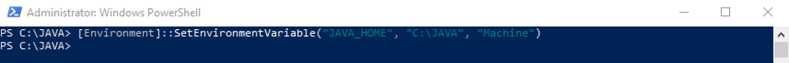

Once added, you could add path environment (```%JAVA_HOME%\bin```):

|  |    |
|	-----	|	-----	|
|		|		|


Don&#x2019;t forget disable the automatic updates:


## <font style="Color:blue;">Install Conda</font>

You could install anaconda distribution from [https://repo.anaconda.com/archive/Anaconda3-2022.10-Windows-x86_64.exe](https://repo.anaconda.com/archive/Anaconda3-2022.10-Windows-x86_64.exe):


Install on [```C:\Anaconda3\```] folder:

|  |    |
|	-----	|	-----	|

## <font style="Color:blue;">Uninstall Anaconda</font>

To uninstall Anaconda, you can do a simple remove of the program. This will leave a few files behind, which for most users is just fine. See [**Option A**](#-option-a---use-simple-remove-to-uninstall-anaconda).

### • **Option A** - Use simple remove to uninstall Anaconda:

* Windows&#x2013;In the Control Panel, choose Add or Remove Programs or Uninstall a program, and then select Python 3.*n* (*Anaconda*) or your version of Python.

* Use Uninstall-Anaconda.exe in [```C:\Users\username\Anaconda3```]

* [... also solutions for Mac and Linux are provided here: [https://docs.anaconda.com/anaconda/install/uninstall/](https://docs.anaconda.com/anaconda/install/uninstall/) ]

### • **Option B** - Full uninstall using ```Anaconda-Clean``` and simple remove. **NOTE:** Anaconda-Clean must be run before simple remove.

* Install the Anaconda-Clean package from Anaconda Prompt (*Terminal on Linux or macOS*):

* ```conda install anaconda-clean```

* In the same window, run one of these commands:

	* Remove all Anaconda-related files and directories with a confirmation prompt before deleting each one:

	* ```anaconda-clean``` 

	* Or, remove all Anaconda-related files and directories without being prompted to delete each one:

	* ```anaconda-clean –yes```

* *Anaconda-Clean* creates a backup of all files and directories that might be removed in a folder named ```.anaconda_backup``` in your home directory. Also note that *Anaconda-Clean* leaves your data files in the *AnacondaProjects* directory untouched.

* After using *Anaconda-Clean*, follow the instructions above in [**Option A**](#-option-a---use-simple-remove-to-uninstall-anaconda) to uninstall Anaconda.

## <font style="Color:blue;">Install WinUtils</font>

You could install [WinUtils](https://github.com/steveloughran/winutils) using next PowerShell script (*as administrator*):

```powershell
cd \;
mkdir “hadoop”;
New-Item -Path "C:\hadoop\bin" -ItemType Directory -Force;
Invoke-WebRequest -Uri https://github.com/steveloughran/winutils/blob/master/hadoop-3.0.0/bin/winutils.exe -OutFile "C:\hadoop\bin\winutils.exe";
[Environment]::SetEnvironmentVariable("HADOOP_HOME", "C:\hadoop", "Machine");
```


## <font style="Color:blue;">Create Virtual Environment on Conda</font>

I recommend you create a separated Virtual Environment on conda to setup your installations and configurations, you could find additional information on:

[https://docs.conda.io/projects/conda/en/latest/user-guide/concepts/environments.html](https://docs.conda.io/projects/conda/en/latest/user-guide/concepts/environments.html)

[https://docs.conda.io/projects/conda/en/latest/user-guide/tasks/manage-environments.html](https://docs.conda.io/projects/conda/en/latest/user-guide/tasks/manage-environments.html)


On this example, we&#x2019;ll use one called &#x201c;*```GatoPlayero```*&#x201d;, but you can change it using whatever you want, obviously with names without blank spaces. On Anaconda PowerShell Prompt run [```conda create --name GatoPlayero python=3.10.9```]:

|	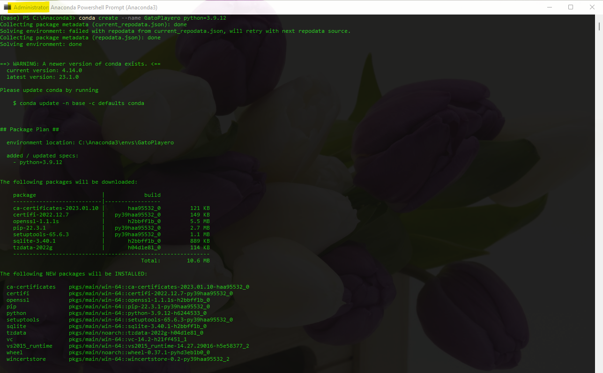	|
|	-----	|
|		|

To check Python Version use &#x201c;```python --version```&#x201d; on conda.

On Databricks ***Runtime 6+ Python*** you should use [```conda create --name GatoPlayero python=3.10.9```]

You could do more with the Virtual Environments:

|	Action	|	Command	|
|	-----	|	-----	|
|	•	List:	|	```conda info --envs```	|
|	•	Remove:	|	```conda env remove --name GatoPlayero```	|
|	•	Activate:	|	```conda activate GatoPlayero```	|
|	•	Deactivate:	|	```conda deactivate```	|

## <font style="Color:blue;">Update pip</font>

Activate Virtual Environment using [```conda activate GatoPlayero```], once you&#x2019;re on your virtual environment you could run [```pip uninstall pyspark```], then run [```python -m pip install --upgrade pip```] to update pip:


## <font style="Color:blue;">Install Databricks-Connect</font>

Run [```pip install -U databricks-connect```] or if you&#x2019;re using ***Python3*** use [```pip3 install -U databricks-connect==12.2.*```] to install on conda virtual environment the same version used on your cluster, consider that you should review the runtime on your cluster:

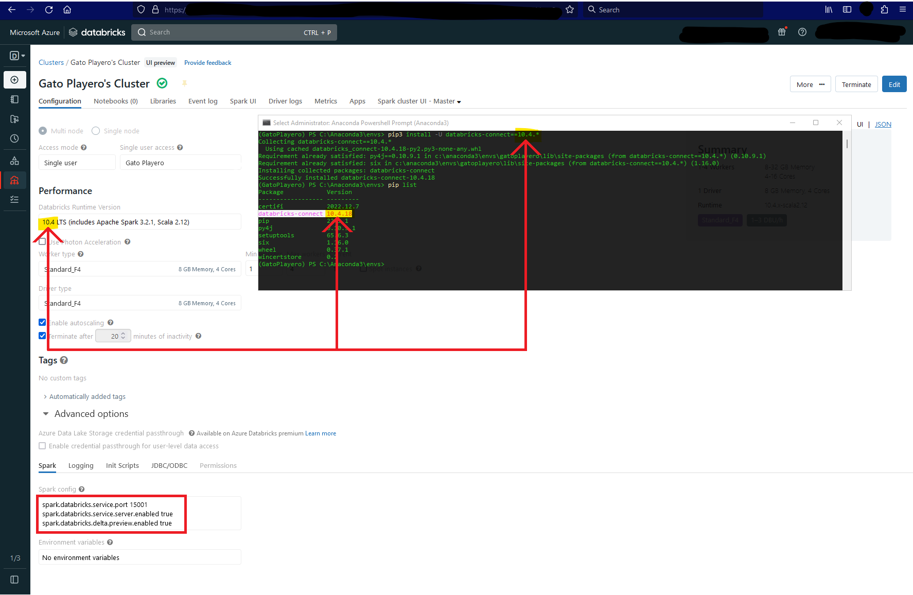

You should configure remote port on cluster advanced configurations, add next lines (*you could change default port 15001*) on spark config for the remote cluster:

```
spark.databricks.service.port 15001
spark.databricks.service.server.enabled true
spark.databricks.delta.preview.enabled true
```

You could always uninstall any version installed through [```pip list```], you could list the libraries installed and uninstall them indicating a specific version:


You could find additional information (including troubleshooting) on: 

- https://docs.microsoft.com/en-us/azure/databricks/dev-tools/databricks-connect
- https://docs.databricks.com/dev-tools/databricks-connect.html
- https://pypi.org/project/databricks-connect/

## <font style="Color:blue;">Configurations on Databricks Cluster</font>

You should create a Token on Azure Databricks cluster before configure it locally [*https://docs.microsoft.com/en-us/azure/databricks/dev-tools/api/latest/authentication*]:


With the URL of the cluster, you should be able to extract all required information for local configuration:

|	URL	|	[<font style="font-family:courier, courier new, serif;font-size:16px;Color:OrangeRed;">https://westus.azuredatabricks.net/</font><font style="font-family:courier, courier new, serif;font-size:16px;Color:DimGray;">?o=</font><font style="font-family:courier, courier new, serif;font-size:16px;Color:Blue;">7692xxxxxxxx</font><font style="font-family:courier, courier new, serif;font-size:16px;Color:DimGray;">#/setting/clusters/</font><font style="font-family:courier, courier new, serif;font-size:16px;Color:Green;">xxxx-xxxxxx-chxxxxx</font><font style="font-family:courier, courier new, serif;font-size:16px;Color:DimGray;">/configuration</font>](#) |
|	:-----	|	:-----	|
|	Organization ID	|	**<font style="font-family:courier, courier new, serif;font-size:16px;Color:Blue;">7692xxxxxxxx</font>**	|
|	Port	|	15001	|
|	Host URL	|	[**<font style="font-family:courier, courier new, serif;font-size:16px;Color:OrangeRed;">https://westus.azuredatabricks.net/</font>**](#)	|
|	Cluster ID	|	**<font style="font-family:courier, courier new, serif;font-size:16px;Color:Green;">xxxx-xxxxxx-chxxxxx</font>**

## <font style="Color:blue;">Install databricks-cli</font>

Run [```pip install databricks-cli```] or if using ***Python3***, run [```pip3 install databricks-cli```] on conda environment (*disable firewall if required*):

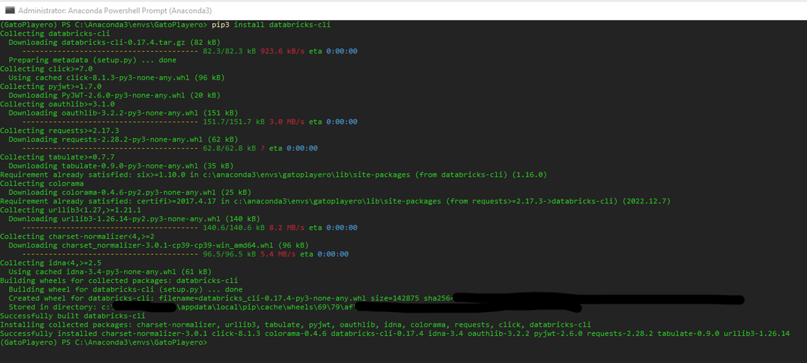


## <font style="Color:blue;">Configure databricks-connect</font>

Run [```databricks-connect configure```] on conda environment, enter all previous configurations as requested:

|	[```databricks-connect configure```]	|	Disable firewall if required:	|
|	-----	|	-----	|
| 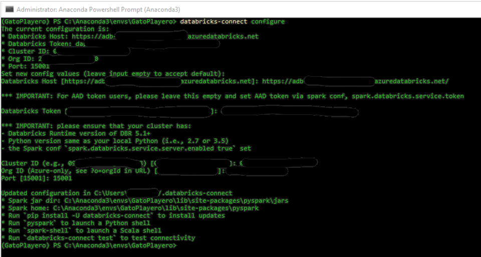 |    |

Output:

```
Updated configuration in C:\Users\albertoc/.databricks-connect
* Spark jar dir: C:\Anaconda3\envs\GatoPlayero\lib\site-packages\pyspark\jars
* Spark home: C:\Anaconda3\envs\GatoPlayero\lib\site-packages\pyspark
* Run `pip install -U databricks-connect` to install updates
* Run `pyspark` to launch a Python shell
* Run `spark-shell` to launch a Scala shell
* Run `databricks-connect test` to test connectivity
```

 **<font style="Color:red;">IMPORTANT NOTE:</font>**&nbsp;You could review or renew the configurations anytime running again [```databricks-connect configure```] on conda environment as required.

Run [```databricks configure --token```] to configure token and run [```databricks --version```] to review installed version:


 **<font style="Color:red;">IMPORTANT NOTE:</font>**&nbsp;You could review or renew the token configurations anytime running again [```databricks configure --token```] on conda environment as required.

Check the ```.databrickscfg``` file on [```C:\Users\<currentUser>\.databrickscfg```] contains a corresponding profile entry:

```html
[<profile-name>]
host = <workspace-URL>
token = <token>
```

```
[DEFAULT]
host = https://xxxxxxxxxxxxxxxxxxx.azuredatabricks.net
token = xxxxxxxxxxxxxxxxxxxxxxxxxxxxxxxxx-2
jobs-api-version = 2.0
```

Check the ```.databricks-connect``` file on [```C:\Users\<currentUser>\.databricks-connect```] contains a corresponding profile entry:

```json
{
	"host": "https:// xxxxxxxxxxxxxxxxxxx.azuredatabricks.net",
	"token": "xxxxxxxxxxxxxxxxxxxxxxxxxxxxxxxxx-2",
	"cluster_id": "xxxx-xxxxxx-xxxxxxx",
	"org_id": "xxxxxxxxxxxx",
	"port": "15001"
}
```

Additional information [https://docs.microsoft.com/en-us/azure/databricks/dev-tools/databricks-cli]

You could match local runtime with remote configurations:

|	Databricks-Connect Runtime Version	|	Runtime	|
|	-----	|	-----	|
|	•	13.2.*:	|	```13.2, Scala 2.12, Spark 3.4.0```	|
|	•	13.1.*:	|	```13.1, Scala 2.12, Spark 3.4.0```	|
|	•	13.0.*:	|	```13.0, Scala 2.12, Spark 3.4.0```	|
|	•	**12.2.***:	|	```12.2 LTS, Scala 2.12, Spark 3.3.2```	|
|	•	11.3.*:	|	```11.3 LTS, Scala 2.12, Spark 3.3.0```	|
|	•	10.4.*:	|	```10.4 LTS, Scala 2.12, Spark 3.2.1```	|

## <font style="Color:blue;">Test databricks-connect</font>

Now you&#x2019;re ready to connect to your cluster, if the cluster is turned off for inactivity, the connection will start it automatically, run [```databricks-connect test```] on conda environment:


You could review your local connection on the cluster:


 **<font style="Color:Cyan;">NOTE:</font>**&nbsp;If you&#x2019;re scripting is unable to find [```JAVA_HOME```], don&#x2019;t forget to set your environment variable:

```PowerShell
[Environment]::SetEnvironmentVariable("JAVA_HOME", "C:\Program Files\Java\jdk1.8.0_361", "Machine");
```

 **<font style="Color:Cyan;">NOTE:</font>**&nbsp;If you receive error:&nbsp;&#x201c;*```Python was not found; run without arguments to install from the Microsoft Store, or disable this shortcut from Settings > Manage App Execution Aliases.
The system cannot find the path specified.```*&#x201d;, you could run command on conda:

```PowerShell
$env:PYSPARK_DRIVER_PYTHON=python -c "import sys; print(sys.executable)"
```

Or try opening a new conda command window and running:

```PowerShell
spark-class org.apache.spark.deploy.master.Master
```

Now you can try to run scala using [```spark-shell```] or [```spark-shell --master spark://172.27.16.128:4040```] or any provided port number from the local cluser:


Or you can try to run python using [```pyspark```]:


When using scala spark shell, you could always exit:

```Scala
:quit
// or
:q
// or
// Ctrl + d // Unix
// Ctrl + z // Windows
// or
sys.exit
```

When using scala pyspark, you could always exit:

```Python
exit()
```


## <font style="Color:blue;">Install&nbsp;and&nbsp;Configure&nbsp;IntelliJ&nbsp;IDE</font>

You could download and install IDE from:

- https://www.jetbrains.com/idea/download/other.html

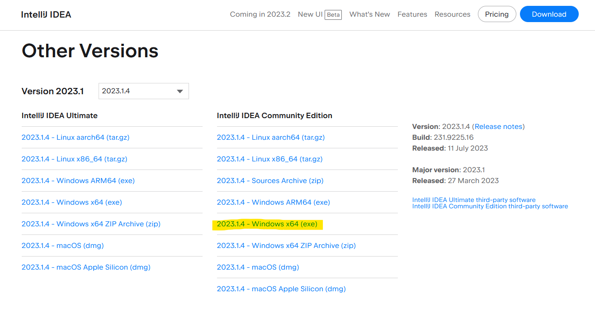

Once installed, install next plugins:


|	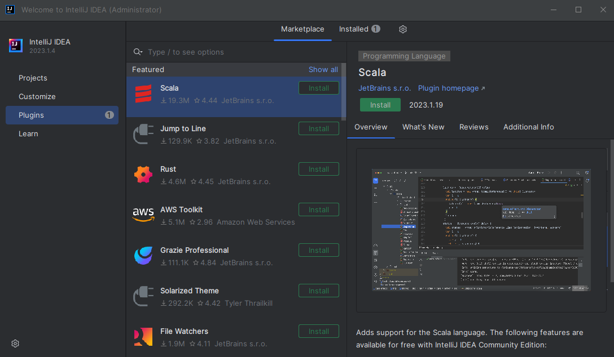	|		|
|	:-----	|	:-----	|
|		|		|
|		|		|


If ```Azure Toolkit for IntelliJ``` is NOT available on the list, you could download from:

- [Azure Toolkit for IntelliJ - Plugins | JetBrains](https://plugins.jetbrains.com/plugin/8053-azure-toolkit-for-intellij/versions/)


Once downloaded and configured, we could install directly on IntelliJ using the ZIP file:


## <font style="Color:blue;">Create&nbsp;Scala&nbsp;Application&nbsp;JAR</font>

Now, you should be able to create a new Scala project on IntelliJ, review that should be anebled *Maven* as build-dependencie's type:


Review the JAVA version on your environment, and check that the *Scala* version match with your cluster's version:

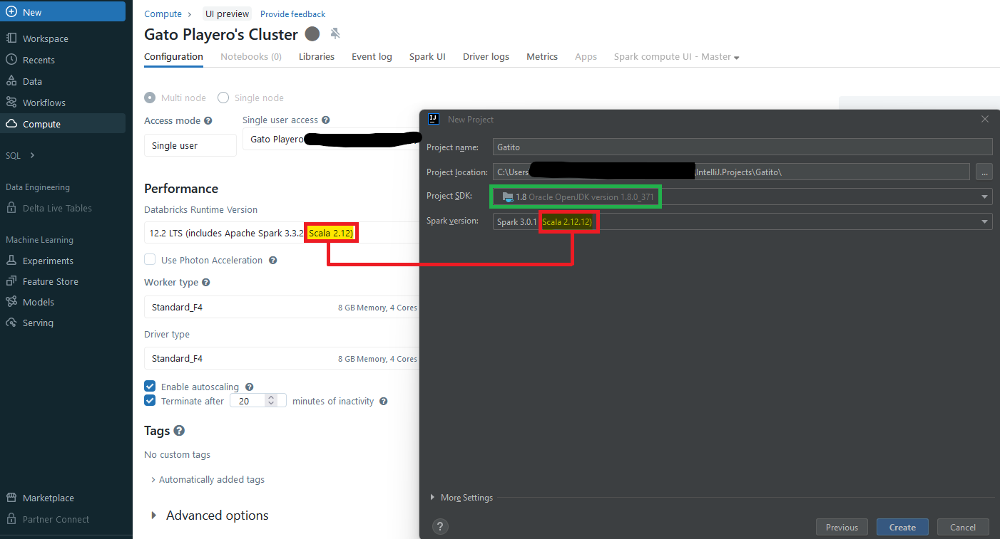

Go To *project structure* settings [Ctrl+Alt+Shift+S] on File &larr; Project Structure:


On *project structure* settings, go to “SDKs” to add/configure your local conda environment:


Add databrick libraries, copy the *jar* local directory verifying jar-dir on your *databricks-connect* configuration, you can run [```databricks-connect get-jar-dir```] on conda environment to get the directory:


Then you'll be able to add all libraries on *project structure* on *“Libraries”*:


You'll need to define spark dependency on ```pom.xml``` file, you could go to *mvnrepository* [```https://mvnrepository.com/artifact/org.apache.spark/spark-core```] and be sure to use the same spark version than your cluster:

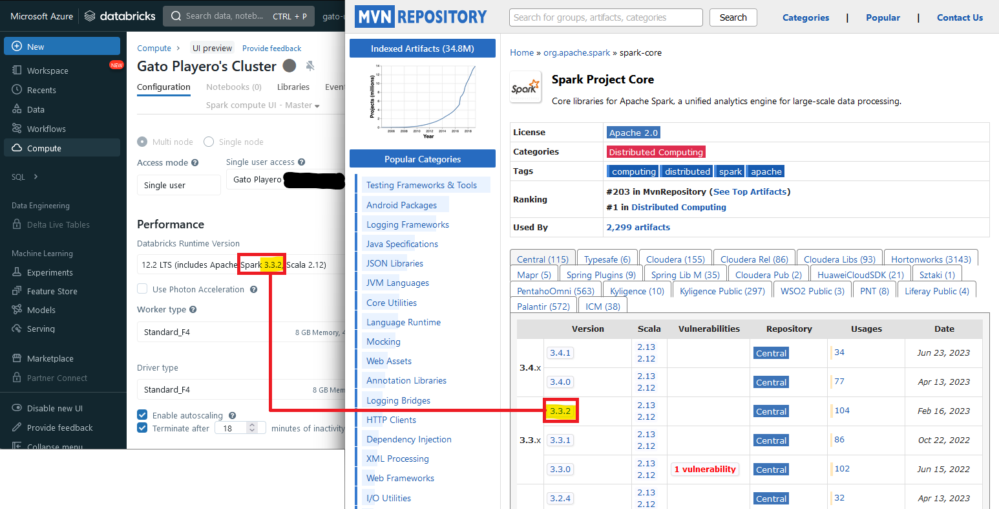

Once updated dependencies on ```pom.xml```, don’t forget load changes [```Ctrl + Shift + O```]:


All of them should appears available once finished depndencie's update:


Add a new *scala class*, in the project file structure:

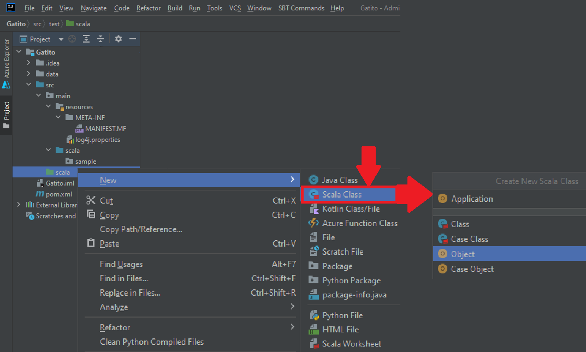

Let's add the ```MANIDEST``` file for the final ```.jar``` file, the file structure should be [```.\src\main\resources\META-INF\MANIFEST.MF```], remember to set the same *main-class* than the defined on the *scala class*:

```
Manifest-Version: 1.0
Main-Class: Application
```


Now you're ready to code, let's try a simple routine to print a ```Hello World``` message, add next code on </br>[```.\src\main\scala\Application.scala```] file:

```Scala
package GatoPlayero

import org.apache.log4j.Level
import org.apache.spark.sql.SparkSession
import org.apache.spark.SparkConf
import org.apache.spark.SparkContext
import java.util.concurrent.Executors

object Application {
	def main(args: Array[String]): Unit = {
		//
		// review incoming parameters
		if (args != null) {
			if (args.length > 0) {
				for (currentArg <- args) {
					println("Current Argument : %s".format(currentArg))
				}
			}
		}
		// define logger level
		val logger = org.apache.log4j.Logger.getLogger("org/apache/spark/log4j-defaults.properties")
		logger.setLevel(Level.WARN)
		//
		// define local session
		val _SparkSession = SparkSession.builder().getOrCreate()
		//
		// print message
		println("Hello Gatito on Spark Version 3.3.2 !!!")
		//
	}
}
```

Review *project structure* to check that you have enabled ONLY ONE *source folder*, in addition of the basic resources and exclusions:

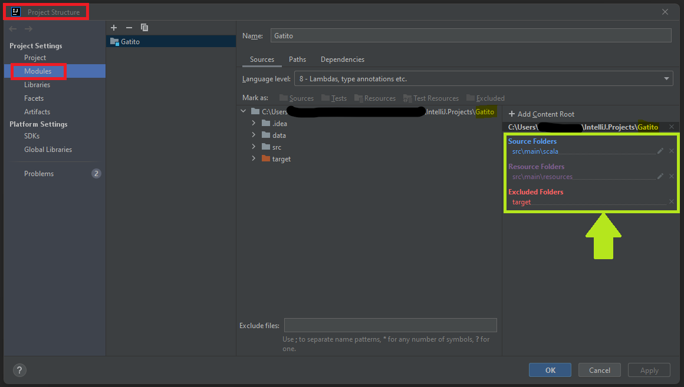

Once you have the application ready to deploy, you’ll need to generate the JAR file, on IntelliJ, go to Project Structure [```Ctrl+Alt+Shift+S```] and review the “*Artifact*” configuration, you could “*Include in project build*” to generate the JAR when you build the application, when you deploy the JAR into the cluster, you’ll need to include any “*library dependencies*” for the project runs normally, for now, let’s try to generate a simple JAR with no additional libraries to try a “*clean*” unitary test: 


The final configuration should looks like:


Now you can *Build* the application [```Ctrl+F9```] and you’ll notice that the JAR file was created after “*compilation*”:


## <font style="Color:blue;">Enable & Manage DBFS on WebBrowser Cluster</font>

As described on [documentation](https://learn.microsoft.com/en-us/azure/databricks/administration-guide/workspace/settings/dbfs-browser), you should enable DBMS on your browser:

*As a workspace admin user, you can manage your users’ ability to browse data in the Databricks File System (DBFS) using the [visual browser interface](https://learn.microsoft.com/en-us/azure/databricks/dbfs/file-browser).*

1. Go to the [admin settings](https://learn.microsoft.com/en-us/azure/databricks/administration-guide/#admin-settings) page.
2. Click the Workspace Settings tab.
3. In the Advanced section, click the DBFS File Browser toggle.
4. Click Confirm.

Once enabled, you should be able to [browse/navigate on DBFS](https://learn.microsoft.com/en-us/azure/databricks/dbfs/file-browser):

1. Click Data Icon  Data in the sidebar.
2. Click the **Browse DBFS** button at the top/right of the page.

## <font style="Color:blue;">Create & Run JOB on Databricks Cluster (run scala JAR)</font>

...


<hr><hr><hr><hr><hr><hr><hr><hr>

 **<font style="Color:Cyan;">NOTE:</font>**&nbsp;Optionally, you can add other maven libraries, you could get any necessary libraries for any transformations directly from a maven repository, you’ll need to verify *groupId*, *artifactId* and *version*, like a library to connect AzureSQL using AAD, that requires SQL sparks, in this case we'll use “```com.microsoft.azure:azure-sqldb-spark:1.0.2```” as example, available on: Maven [```https://mvnrepository.com/artifact/com.microsoft.azure/azure-sqldb-spark/1.0.2```] and documented on [```https://github.com/Azure/azure-sqldb-spark```], for this example we could use three libraries required to move/transform data from AzureSQL into Data-Lake Gen2:

|	```com.microsoft.azure:adal4j:1.6.7```	|	https://mvnrepository.com/artifact/com.microsoft.azure/azure-sqldb-spark/1.0.2	|
|	:----------------	|	:------	|
|	```com.databricks:dbutils-api_2.12:0.0.6```	|	https://mvnrepository.com/artifact/com.microsoft.azure/adal4j/1.6.7	|
|	```com.microsoft.azure:azure-sqldb-spark:1.0.2```	|	https://mvnrepository.com/artifact/com.databricks/dbutils-api_2.12/0.0.6	|

On IntelliJ *project structure*, go to *libraries* and add them from Maven repository:


Once you add any necessary libraries, you’ll need to add them as dependencies on the project, because when you add them on *IntelliJ* they’ll be used ONLY to create the JAR file, go to the *project structure*, locate “```pom.xml```” file and in the *“dependencies”* segment, add the dependencies using the same *groupId*, *artifactId* and *version* defined previously:


Format:

```XML
<dependency>
	<groupId>com.microsoft.azure</groupId>
	<artifactId>adal4j</artifactId>
	<version>1.6.7</version>
</dependency>
<dependency>
	<groupId>com.databricks</groupId>
	<artifactId>dbutils-api_2.12</artifactId>
	<version>0.0.6</version>
</dependency>
<dependency>
	<groupId>com.microsoft.azure</groupId>
	<artifactId>azure-sqldb-spark</artifactId>
	<version>1.0.2</version>
</dependency>
```

 **<font style="Color:Cyan;">NOTE:</font>**&nbsp;If you receive an error for *“long COMPILATION”*, you could add a *dynamic.classpath* on your project, on your project's main folder, locate ```.idea``` folder, edit ```workspace.xml``` and add:

```XML
<property name="dynamic.classpath" value="true" />
```

Inside of:

```XML
<component name="PropertiesComponent">
	.
	.
	.
</component>
```

Example:

```XML
<component name="PropertiesComponent">
	<![CDATA[{
	"keyToString": {
	"Downloaded.Files.Path.Enabled": "false",
	"Repository.Attach.Annotations": "false",
	"Repository.Attach.JavaDocs": "false",
	"Repository.Attach.Sources": "false",
	"RunOnceActivity.OpenProjectViewOnStart": "true",
	"RunOnceActivity.ShowReadmeOnStart": "true",
	"ignore.virus.scanning.warn.message": "true",
	"last_opened_file_path": "C:/Anaconda3/envs/GatoPlayero/Lib/site-packages/pyspark/jars",
	"project.structure.last.edited": "Libraries",
	"project.structure.proportion": "0.15",
	"project.structure.side.proportion": "0.27126437"
	}
	}]]>
	<property name="dynamic.classpath" value="true" />
</component>
```

If you don't see one, feel free to add it by yourself:


```XML
<component name="PropertiesComponent">
	<property name="dynamic.classpath" value="true" />
</component>
```
