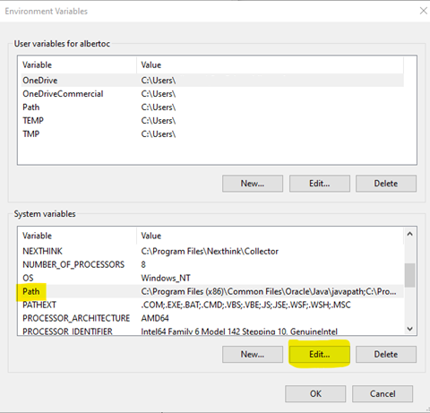

# Create JAR with Scala & Execute on Azure Databricks

> <i>by Alberto Cesar <gato.playero@proton.me></i>

<hr>

## Table of Contents
1. **[Configure Databricks Cluster](#Configure&nbsp;Databricks&nbsp;Cluster)**
2. **[Install JDK](#Install_JDK)**
3. **[Install Conda](#Install&#160;Conda)**

<hr>

&#160;1&nbsp;2&#160;

## <font style="Color:blue;">Configure Databricks Cluster</font>

I’ll go directly to the development without entering into the Databricks setup and configuration on Azure, you could find more information on:

- https://docs.microsoft.com/en-us/azure/storage/blobs/data-lake-storage-use-databricks-spark
- https://docs.microsoft.com/en-us/azure/storage/blobs/data-lake-storage-quickstart-create-databricks-account
- https://docs.microsoft.com/en-us/azure/databricks/getting-started/try-databricks
- https://docs.microsoft.com/en-us/azure/azure-databricks/

## <font style="Color:blue;">Install_JDK</font>

Download JDK from [https://www.oracle.com/java/technologies/javase-jdk8-downloads.html](https://www.oracle.com/java/technologies/javase-jdk8-downloads.html), is required to work on JDK Version 8

<!--  -->


Install JAVA on [```C:\JAVA\```] folder:


You should install JRE on a separated folder:


You should be able to review if installed correctly through command prompt using “```java -version```”:


Once installed, you should configure the global “```JAVA_HOME```” environment variable, you could do it on PowerShell (*as administrator*):


```powershell applyLineNumbers
[Environment]::SetEnvironmentVariable("JAVA_HOME", "C:\JAVA", "Machine")
```


Once added, you could add path environment (```%JAVA_HOME%\bin```):

|		|		|

|		|		|

Don’t forget disable the automatic updates:


## <font style="Color:blue;">Install Conda</font>

You could install anaconda distribution from [https://repo.anaconda.com/archive/Anaconda3-2022.10-Windows-x86_64.exe(https://repo.anaconda.com/archive/Anaconda3-2022.10-Windows-x86_64.exe]:

